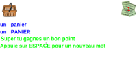

 
# RktMaternelleCP
apprend  à écrire tes premiers mots

## BUT  
Ce programme à été écrit sur la version **7.2  de Racket** à destination de mes petits enfants ;-)

2 versions
 * **ecrire.rkt** utilise **eSpeak** un synthétiseur vocal moyen en français   
 * **ecrireWav.rkt** utilise uniquement des sons .wav donc pas besoin de l'installation de **eSpeak**

**ecrire** fonctionne sur un **Linux Mint 19** mais devrait pouvoir fonctionner sur **MacOS** ou **Windows** à la condition qu'une version du logiciel libre **eSpeak** soit utilisable dessus    
**ecrireWav** devrait marcher partout sans ajout     

en cas d'erreur le mot s'affiche en fond clair pour aider    
chaque mot sans erreur donne un bon point ;-)    


## Installation  
installer [**eSpeak**](http://espeak.sourceforge.net/) si besoin
*si vous connaissez mieux comme synthé vocal en mode autonome et gratuit dites moi ;-)*   

puis intaller [**RACKET**](https://racket-lang.org/)   

Cloner ce repo dans un répertoire de votre convenance   
``` git clone https://github.com/nodrygo/RktMaternelleCP ```  

puis décompressez le fichier des imagettes dans le répertoire *RktMaternelleCP*  
ceci doit crée un répertoire *img* indispensable    

pour la version **ecrireWav** il faut décompresser les **sons.7z** dans le répertoire *RktMaternelleCP*    
ceci doit créer un répertoire **sons** contenant tous les *.wav*

# Utilisation   
Ensuite avec **_drracket_** ou _**gracket**_  ouvrez et exécutez **ecrire.rkt** ou **ecrireWav.rkt**   
*vous pourrez le compiler pour le rendre autonome sur votre plateforme*    
*un .exe pour WINDOWS 8 et plus sera fourni plus tard*     

il est librement utilisable par qui le désire mais aux risques et périls des utilisateurs  

la touche ***return*** permet de sélectionner un nouveau mot 
*pour l'instant pas de tiret mais l'espace devrait fonctionner*    
*les caractères complexes tel que circonflexe sont à bannir car difficile à trouver*          
les mots ne sont plus choisi aléatoirement mais un un cycle après un mélange  
la touche ***echap*** (***escape***) permet de QUITTER 


## Autres ressources
toutes les imagettes sont issues de sites libres et gratuits suivants    
- [free_icons](https://www.iconfinder.com/free_icons)     
- [https://racket-lang.org/](https://www.fr.clipproject.info/clip-art-gratuit/)    
